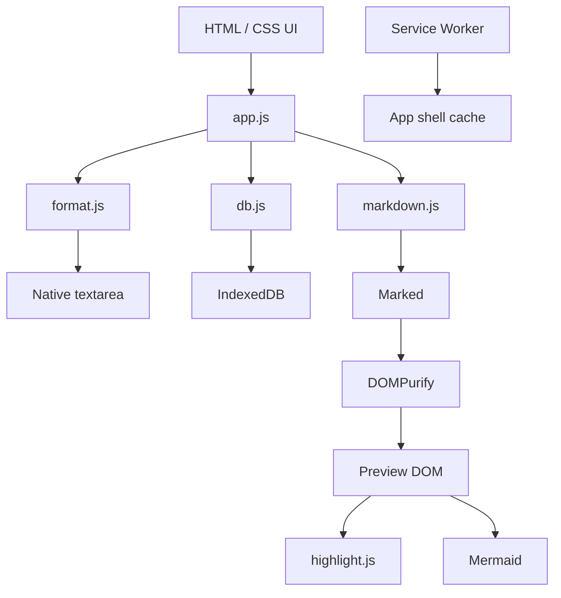

# Mote - Architecture Design

> Web-first, local-first, Markdown-first.

## 1. Goal

Mote uses a small architecture that is easy to understand and maintain:

```text
HTML + CSS + Vanilla JavaScript
            ↓
Native browser APIs
            ↓
IndexedDB
```

Vite is the build tool, not an application framework.

## 2. High-level architecture



## 3. Source of truth

Each note stores:

```text
contentMarkdown: string
```

Rendered HTML, syntax highlighting and Mermaid SVG are derived. They are never the note source of truth.

## 4. Modules

```text
src/
├── app.js       UI state, events and feature orchestration
├── db.js        IndexedDB persistence and backup transactions
├── format.js    Pure Markdown selection transforms
├── markdown.js  Markdown Preview pipeline
└── styles.css   Product styling and responsive layout
```

Keep this structure until a file becomes genuinely difficult to reason about. Do not pre-create extra architectural layers without a concrete need.

## 5. Editor architecture

Markdown mode uses a normal `<textarea>`.

Formatting flow:

```text
textarea.value
+ selectionStart
+ selectionEnd
      ↓
formatSelection()
      ↓
new string + new selection
      ↓
textarea.value
```

`format.js` keeps formatting transformations pure where practical so they can be unit-tested without browser rendering.

Preview is a separate read-only view:

```text
Markdown source
    ↓
Marked
    ↓
DOMPurify
    ↓
Preview DOM
    ├── highlight.js
    ├── Mermaid
    └── heading IDs for outline
```

Markdown and Preview do not maintain a pixel-perfect scroll/caret mapping. This keeps the editing path simple and lets native selection behavior remain independent from rendered content.

## 6. Application state

Transient state lives in memory:

- current collection
- current note ID
- search text
- save revision/status
- current Preview headings
- whether the outline is manually collapsed
- open dialogs/menus

Persisted application data lives in IndexedDB:

- groups
- notes
- settings

Layout widths are lightweight local UI preferences stored in `localStorage`:

- notes pane width
- outline width

Derived data such as Preview HTML, counts and search results is not persisted.

## 7. Auto save

```text
input
  ↓
update in-memory note
  ↓
Saving
  ↓
~450 ms debounce
  ↓
IndexedDB write
  ↓
Saved
```

Pending changes are flushed before important navigation/mutations and when the page becomes hidden where possible.

The UI must not display `Saved` before the persistence operation completes.

## 8. Collections

System collections are derived from note fields instead of separate database rows:

- Inbox: active + visible + no group
- Favorites: active + visible + favorite
- Recent: active + visible ordered by `updatedAt`
- Hidden: active + hidden
- Trash: deleted

Groups are persisted rows.

## 9. Responsive shell

### Large desktop - 1200px and above

```text
Navigation | Notes | Editor / Preview | Outline
```

- Navigation: fixed 226px.
- Notes: resizable 220-480px.
- Outline: resizable 160-360px and hideable.

### Compact - 761px to 1199px

Browsing:

```text
Navigation | Notes | Empty editor area
```

After opening a note:

```text
Navigation | Editor
```

The notes pane and outline are hidden while the note is open. Back returns to the notes pane.

### Mobile - 760px and below

Navigation + notes remain the browse surface. The editor opens as a full overlay and closes with Back.

## 10. Resizing

Pane resize handles use Pointer Events.

Notes width:

```text
220px <= width <= 480px
```

Outline width:

```text
160px <= width <= 360px
```

Resize preferences do not change note data and can be safely reset.

## 11. Outline / Scrollspy

The Preview renderer returns heading metadata. On large desktop screens:

```text
Preview headings
      ↓
outline list
      ↓
document scroll
      ↓
active heading
```

The outline can be manually collapsed. When collapsed, a toolbar action restores it. Compact/mobile layouts suppress it automatically.

## 12. PWA

PWA files:

- `manifest.webmanifest`
- `sw.js`
- local branding/icons

The service worker caches the app shell and same-origin static assets. IndexedDB note data is independent from the Cache Storage used by the service worker.

## 13. Security and privacy

- Sanitize rendered Markdown before inserting it into Preview.
- Mermaid uses strict security settings.
- A render failure must never alter Markdown source.
- Do not upload or remotely log raw note content.
- Remote links/images may contact their own origins when used by the browser.

## 14. Error handling

- database open/write failure -> visible error, never pretend the note was saved
- Markdown/Mermaid render failure -> preserve source and show a non-destructive fallback
- backup validation failure -> do not modify current database
- file import failure -> do not destroy existing notes

## 15. Testing

Automated checks cover:

- JavaScript syntax
- Markdown selection transforms
- production build

Manual browser testing should cover:

- selection and caret behavior
- copy/paste and undo/redo
- links and code blocks
- Preview/MD switching
- pane resize/hide/show
- 1024px compact layout
- mobile keyboard and navigation
- favicon/PWA installation

## 16. Complexity rule

Add a new abstraction only when the current implementation has a demonstrated limitation. Avoid adding frameworks, editor engines or backend layers in anticipation of hypothetical requirements.
