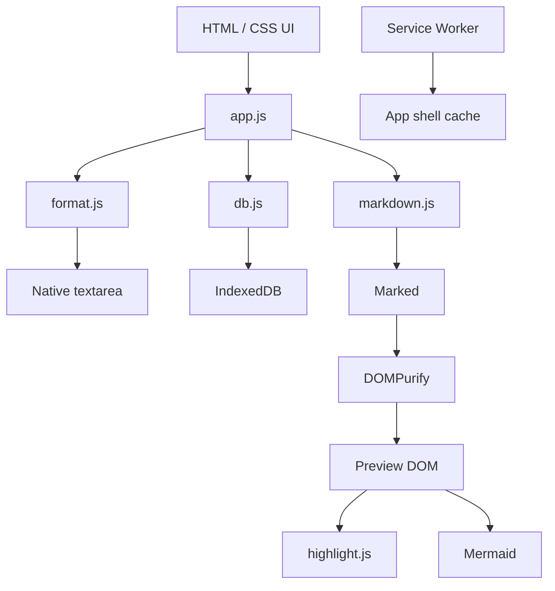

# Mote - Architecture Design

> Web-first, local-first, Markdown-first.

## 1. Architecture goal

Mote should be small enough to understand without a framework-specific architecture diagram.

The web MVP uses:

```text
HTML + CSS + Vanilla JavaScript
            ↓
Native browser APIs
            ↓
IndexedDB
```

Vite is a build tool only. It is not the application framework.

## 2. High-level architecture



## 3. Source of truth

Each note stores:

```text
contentMarkdown: string
```

No rendered HTML is persisted. No rich-text tree is persisted. Preview can always be regenerated from Markdown source.

## 4. Editor architecture

### Markdown mode

Use a normal `<textarea>`.

Do not implement a custom text renderer for the editing surface.

Formatting flow:

```text
textarea.value
+ selectionStart
+ selectionEnd
      ↓
formatSelection()
      ↓
new string + new selection
      ↓
textarea.value
```

`format.js` contains pure Markdown string transforms wherever possible so editor behavior can be tested without DOM rendering.

### Why no custom scroll/caret mapping?

Markdown mode and Preview are intentionally independent views of the same source.

Switching views does not need to reproduce an exact rendered pixel position. Avoid coupling selection/caret state to Markdown parser block positions.

This removes a large class of bugs around caret reveal, selection jumps, mobile keyboard resizing, code block selection and view-switch scroll restoration.

### Preview mode

Preview is read-only rendered DOM.

```text
Markdown string
    ↓
Marked
    ↓
DOMPurify
    ↓
Preview DOM
    ├── highlight.js for code
    ├── Mermaid for mermaid blocks
    └── heading IDs for outline
```

External links receive safe `rel` attributes. Mermaid uses strict security settings.

## 5. Application modules

```text
src/
├── app.js       UI state, events, feature orchestration
├── db.js        IndexedDB persistence and backup transactions
├── format.js    Pure Markdown selection transforms
├── markdown.js  Markdown render pipeline
└── styles.css   Product styling and responsive layout
```

Keep this structure until a file becomes hard to reason about. Do not pre-create domain/usecase/controller layers just to imitate a larger application architecture.

## 6. State model

Transient UI state lives in memory:

```text
current collection
current note ID
search text
save status/revision
current headings
open dialogs
```

Persisted state lives in IndexedDB:

```text
groups
notes
settings
```

Do not persist derived data such as rendered HTML, current search results or collection counts.

## 7. Auto save

```text
input
  ↓
update in-memory note
  ↓
mark Saving
  ↓
~450 ms debounce
  ↓
IndexedDB put
  ↓
mark Saved
```

Pending changes are also flushed when the page becomes hidden and before relevant navigation/mutations where possible.

The UI must never report `Saved` before the corresponding IndexedDB write completes.

## 8. Database

Use native IndexedDB directly.

The database is named:

```text
mote-web-v2
```

This intentionally does not reuse the old Flutter Drift database namespace.

See `Database_Design.md`.

## 9. PWA architecture

The PWA consists of:

- `manifest.webmanifest`
- `sw.js`
- icons/branding assets

The service worker caches the application shell and same-origin static assets for resilience.

IndexedDB note data is independent from the service worker cache. A service worker update must never delete application data.

## 10. Security and privacy

### Rendered Markdown

Raw Markdown must not be inserted into the DOM as trusted HTML. Render flow uses sanitization before the result is attached to Preview.

### Mermaid

Use strict Mermaid security settings. If rendering fails, keep the Markdown source unchanged and show a non-destructive fallback/error state.

### External content

Remote Markdown images and links may cause the browser to contact external origins when the user opens Preview. Mote itself does not upload note content to a server.

### Local-first

Do not log raw note content to remote analytics or crash reporting.

## 11. Responsive layout

### Desktop

```text
┌─────────────┬──────────────┬──────────────────────────┬───────────┐
│ Collections │ Notes        │ Editor / Preview         │ Outline   │
└─────────────┴──────────────┴──────────────────────────┴───────────┘
```

### Mobile

Use list -> editor navigation within the same page shell.

The editor toolbar remains horizontally scrollable rather than wrapping into multiple rows. Native textarea behavior remains the priority when the on-screen keyboard is open.

## 12. Error handling

- database open/write failure -> visible message, do not pretend data is saved
- Markdown render failure -> preserve source, show failure state
- Mermaid failure -> preserve source, show source/error fallback
- backup validation failure -> do not modify current database
- file import failure -> skip/report the affected file without destroying existing data

## 13. Performance

MVP optimizations:

- debounce writes
- render Preview only when needed or content changed
- avoid storing rendered HTML
- query small local datasets in memory after IndexedDB load
- avoid heavyweight editor abstractions

Do not add workers, virtualized lists, full-text indexes or caching layers without measured need.

## 14. Testing strategy

### Automated

At minimum test pure editor transformations for:

- bold/italic wrappers
- links
- inline code
- fenced code blocks
- multi-line list operations
- collapsed and non-collapsed selections

Run JavaScript syntax checks for application modules.

### Manual

Production editor smoke tests should cover:

- Chrome/Edge desktop
- Safari/iPhone
- Chrome/Android when available
- text selection
- double click/double tap
- copy/paste
- undo/redo
- code block editing
- link editing
- mobile keyboard
- theme and PWA behavior

## 15. Decision rule for future complexity

Add a new abstraction only when the current implementation has a demonstrated limitation.

Examples:

- adopt CodeMirror only if native textarea limitations become a real user problem
- adopt Capacitor only if native APIs/store distribution become necessary
- add a backend only if sync/account features are validated

Do not introduce these layers in anticipation of hypothetical requirements.
