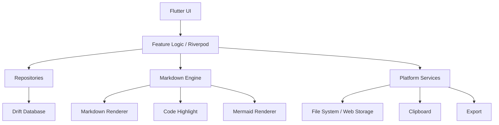
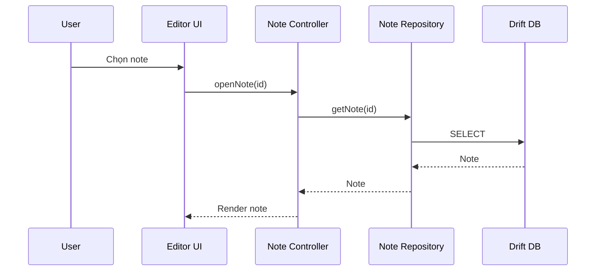

# Mote - Architecture Design

> Flutter single-codebase, local-first, Markdown-first.

## 1. Mục tiêu kiến trúc

- Một codebase cho Web, Windows, Android và iOS.
- UI, business logic, data model và Markdown engine dùng chung tối đa.
- Markdown là source of truth của note.
- MVP chạy hoàn toàn local, không cần account hoặc backend.
- Chỉ tách theo platform ở filesystem, clipboard, export, share và Mermaid renderer khi cần.
- Kiến trúc đủ rõ để AI triển khai nhưng không dùng Clean Architecture quá nặng.

## 2. Kiến trúc tổng thể



## 3. Layer đơn giản

### UI

Chịu trách nhiệm:

- Layout Desktop / Mobile.
- Editor toolbar.
- Text View / Markdown View.
- Scrollspy.
- Dialog, menu, settings.
- Theme và localization.

UI không truy cập database trực tiếp.

### Feature Logic

Riverpod providers/controllers xử lý:

- Note CRUD.
- Group CRUD.
- Search.
- Trash / Restore / Permanent Delete.
- Hidden.
- Auto Save.
- Settings.
- Export flow.

### Repository

Cung cấp interface ổn định giữa feature logic và storage.

```text
NoteRepository
GroupRepository
SettingsRepository
AssetRepository
```

### Core Services

```text
MarkdownService
SearchService
AutoSaveService
FileService
ClipboardService
ExportService
MermaidRenderer
```

## 4. Folder Structure

```text
lib/
├── app/
│   ├── app.dart
│   ├── router.dart
│   ├── localization/
│   └── theme/
│
├── core/
│   ├── database/
│   ├── markdown/
│   ├── platform/
│   ├── export/
│   └── utils/
│
├── features/
│   ├── notes/
│   │   ├── data/
│   │   ├── logic/
│   │   └── ui/
│   ├── groups/
│   ├── editor/
│   ├── search/
│   ├── trash/
│   ├── hidden/
│   └── settings/
│
├── shared/
│   └── widgets/
│
└── main.dart
```

Không tạo thêm domain/usecase/entity layer cho từng thao tác nếu chưa có nhu cầu thật.

## 5. Data Flow chính

### Mở note



### Auto Save

```text
Typing
  -> Editor state thay đổi
  -> Debounce 300-600 ms
  -> NoteController.save()
  -> NoteRepository.update()
  -> Drift transaction
```

Khi app mất focus hoặc route thay đổi, flush pending save nếu platform cho phép.

### Markdown render

```text
contentMarkdown
      |
      +-> Markdown View: raw text
      |
      +-> Markdown Parser
              +-> Text
              +-> Table
              +-> Code Block
              +-> Mermaid
              +-> Heading metadata -> Scrollspy
```

Không lưu HTML hoặc rich-text document song song.

## 6. Editor Architecture

Editor có một document model duy nhất:

```text
String contentMarkdown
```

Toolbar chỉ sửa Markdown source.

Ví dụ:

```text
Select: hello
Click Bold
Result: **hello**
```

Hai view:

- `MarkdownView`: raw Markdown editor.
- `TextView`: render nội dung để đọc/chỉnh sửa thuận tiện.

Nếu Text View cần editor richer sau MVP, vẫn phải map về Markdown source thay vì tạo format riêng.

## 7. Scrollspy

Markdown parser trả thêm:

```text
HeadingNode
- id
- level
- text
- sourceOffset
```

Desktop:

```text
Editor ScrollController
       -> xác định heading gần viewport nhất
       -> activeHeadingId
       -> Scrollspy highlight
```

Click outline:

```text
headingId -> GlobalKey / offset -> scrollTo()
```

Mobile không render Scrollspy cố định.

## 8. Mermaid

Tạo abstraction:

```dart
abstract interface class MermaidRenderer {
  Future<RenderedDiagram> render(String source);
}
```

Implementation có thể khác theo platform:

```text
WebMermaidRenderer
NativeMermaidRenderer
```

Nếu Flutter package không ổn định, native có thể dùng Mermaid.js qua WebView adapter. Phần editor không được phụ thuộc vào implementation này.

- Ưu tiên giải pháp chạy ổn định trên Web.
- Có fallback hiển thị source nếu render thất bại.
- Không dành quá nhiều thời gian hoàn thiện Mermaid native trong giai đoạn này.

## 9. Platform Abstraction

```text
FileService
├── WebFileService
└── NativeFileService

ClipboardService
├── WebClipboardService
└── NativeClipboardService

ExportService
├── WebExportService
└── NativeExportService
```

Platform detection chỉ nằm trong composition/bootstrap, không rải `if (web)` khắp feature code.

## 10. State Management

Dùng Riverpod.

Provider chính:

```text
currentNoteProvider
notesProvider(groupId)
groupsProvider
searchProvider
editorProvider
settingsProvider
trashProvider
hiddenProvider
```

State tạm của UI như menu đang mở có thể dùng local widget state, không đưa tất cả vào global provider.

## 11. Navigation

### Desktop/Web

```text
/
/note/:id
/group/:id
/trash
/settings
/settings/hidden
```

Search và Export ưu tiên dialog/sheet, không cần route riêng.

### Mobile

Dùng cùng route nhưng layout chuyển thành:

```text
Notes List -> Editor
```

Back trả về list thay vì sidebar cố định.

## 12. Error Handling

Phân loại đơn giản:

```text
StorageException
MarkdownRenderException
ExportException
AssetException
```

Nguyên tắc:

- Save lỗi: giữ content trong memory, báo trạng thái chưa lưu.
- Mermaid lỗi: hiện source + thông báo render lỗi, không làm crash note.
- Image lỗi: placeholder, không làm mất Markdown path.
- Export lỗi: báo lỗi, không sửa dữ liệu gốc.

## 13. Performance

MVP chỉ cần:

- Debounce auto-save.
- Lazy load note list khi cần.
- Không parse lại toàn bộ Markdown nếu content không đổi.
- Cache Mermaid render theo hash của source.
- Search database thay vì load toàn bộ library vào memory.

Chưa cần isolate, background indexing hoặc complex cache trước khi đo thấy vấn đề.

## 14. Security / Privacy

MVP local-first:

- Không upload note ra server.
- Không analytics nội dung note.
- Không log raw note content.
- Hidden chỉ là ẩn khỏi UI, không được quảng bá là encryption.

Nếu sau này có App Lock hoặc encryption, thiết kế riêng và cập nhật spec.

## 15. Test Strategy

### Unit

- Note / Group CRUD.
- Trash 30 ngày.
- Search.
- Auto Save debounce.
- Markdown parser extension.
- Heading extraction.

### Widget

- Editor toolbar.
- Text / Markdown switch.
- Scrollspy.
- Theme / localization.

### Manual

- Chrome.
- Windows.
- Android.
- iPhone.

## 16. Nguyên tắc triển khai

> Shared by default, platform-specific only when necessary.

Không làm Web, Windows, Android và iOS song song. Hoàn thiện Web MVP trước, sau đó reuse architecture cho các target còn lại.
