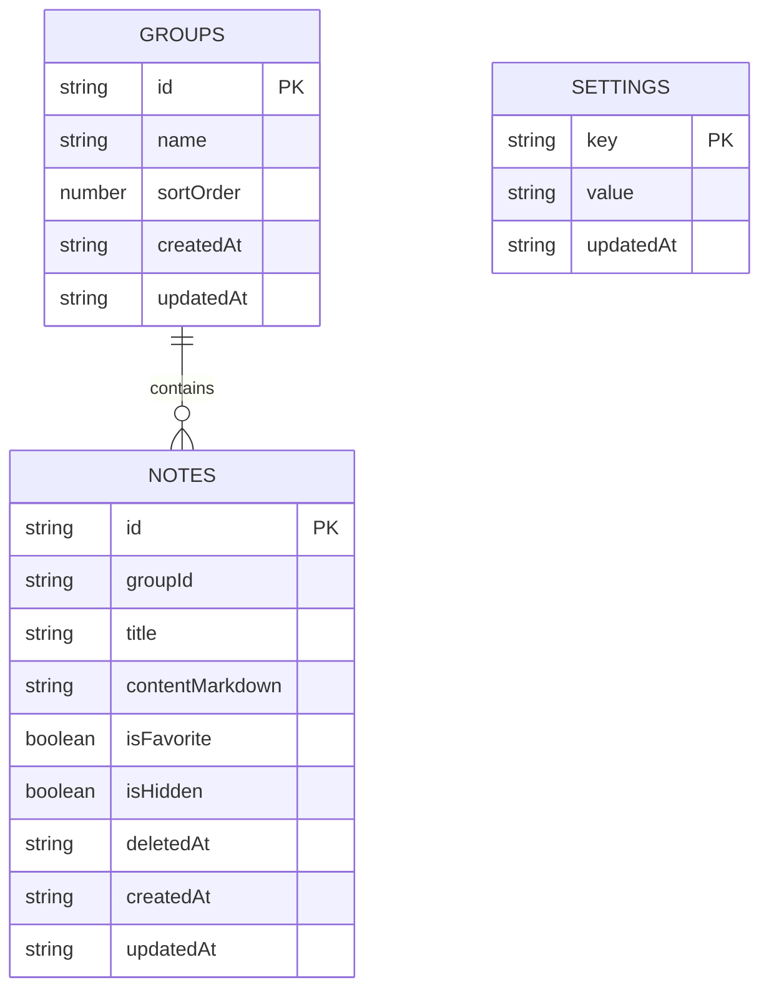

# Mote - Database Design

> IndexedDB, local-first, Markdown-first.

## 1. Goals

The database stores only what Mote needs to restore the user's application state:

- groups
- notes
- settings

Rendered HTML, Mermaid SVG and search results are derived and are not persisted.

## 2. Database identity

```text
name: mote-web-v2
version: 1
```

The separate name is intentional. The old Flutter web implementation used a Drift database named `mote`. The rewrite must not silently reinterpret or overwrite that storage.

## 3. Object stores



Dates are stored as ISO 8601 strings.

## 4. `groups`

Key path: `id`.

| Field | Type | Rule |
| --- | --- | --- |
| `id` | string | stable unique ID |
| `name` | string | required |
| `sortOrder` | number | default 0 |
| `createdAt` | ISO string | required |
| `updatedAt` | ISO string | required |

Index: `sortOrder`.

System collections are not group rows.

## 5. `notes`

Key path: `id`.

| Field | Type | Rule |
| --- | --- | --- |
| `id` | string | stable unique ID |
| `groupId` | string or null | null = Inbox |
| `title` | string | empty allowed, UI shows Untitled |
| `contentMarkdown` | string | Markdown source of truth |
| `isFavorite` | boolean | default false |
| `isHidden` | boolean | default false |
| `deletedAt` | ISO string or null | null = active |
| `createdAt` | ISO string | required |
| `updatedAt` | ISO string | required |

Indexes:

```text
groupId
updatedAt
deletedAt
isHidden
isFavorite
```

Derived collections:

- Inbox: active, visible, `groupId == null`
- Favorites: active, visible, `isFavorite == true`
- Hidden: active, `isHidden == true`
- Trash: `deletedAt != null`

## 6. `settings`

Key path: `key`.

```json
{
  "key": "theme",
  "value": "system",
  "updatedAt": "2026-08-17T00:00:00.000Z"
}
```

Supported settings:

| Key | Values |
| --- | --- |
| `theme` | `system`, `light`, `dark` |
| `language` | `vi`, `en` |
| `editor_view` | `preview`, `markdown` |
| `scrollspy_enabled` | `true`, `false` |

There is no `font_family` setting in the web rewrite.

## 7. Data rules

### Delete group

One read/write transaction should:

1. Find notes belonging to the group.
2. Set their `groupId` to null.
3. Update their `updatedAt`.
4. Delete the group.

A group deletion must not permanently delete notes.

### Trash

Delete note:

```text
deletedAt = now
```

Restore:

```text
deletedAt = null
```

Permanent delete removes the note row.

### 30-day cleanup

At app startup:

```text
now - deletedAt >= 30 days
    ↓
permanent delete
```

No background cron or server job is required.

## 8. Search

The MVP loads the local note list and performs case-insensitive title/content filtering in memory.

Do not add a full-text index until real note volume makes this measurably slow.

## 9. Backup transaction

Full backup is created from snapshots of groups, notes and settings.

Restore must:

1. Parse and validate the complete backup first.
2. Ask the user for destructive confirmation.
3. Clear and replace `groups`, `notes` and `settings` in one IndexedDB transaction.
4. Leave current data unchanged if validation fails before the transaction.

See `Data_Portability.md`.

## 10. Schema migrations

When `DB_VERSION` increases:

- add upgrade logic inside `onupgradeneeded`
- preserve all `contentMarkdown` values
- never delete an object store as a shortcut for migration
- add compatibility tests for existing data shapes
- document the change in `CHANGELOG.md`

Backup format versioning is separate from IndexedDB schema versioning.

## 11. Not in MVP

No stores for users, accounts, sync state, collaboration, comments, AI history, uploaded image binaries, rendered Markdown or Mermaid output.
