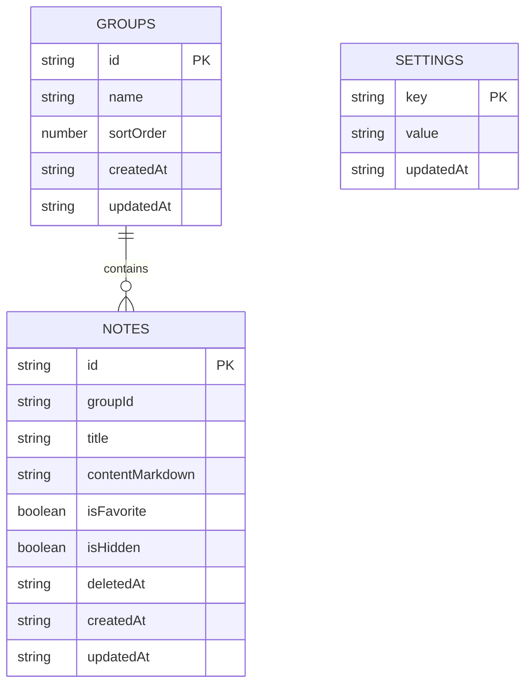

# Mote - Database Design

> IndexedDB, local-first, Markdown-first.

## 1. Goals

The database stores only the application data required to restore Mote:

- groups
- notes
- settings

Rendered HTML, Mermaid SVG, search results and layout widths are not database records.

## 2. Schema version

```text
IndexedDB schema version: 1
```

The internal database identifier is defined in `src/db.js` and should not be changed casually because it identifies the user's local data store.

## 3. Object stores



Dates are stored as ISO 8601 strings.

## 4. `groups`

Key path: `id`.

| Field | Type | Rule |
| --- | --- | --- |
| `id` | string | stable unique ID |
| `name` | string | required |
| `sortOrder` | number | default 0 |
| `createdAt` | ISO string | required |
| `updatedAt` | ISO string | required |

Index: `sortOrder`.

System collections are not group rows.

## 5. `notes`

Key path: `id`.

| Field | Type | Rule |
| --- | --- | --- |
| `id` | string | stable unique ID |
| `groupId` | string or null | null = Inbox |
| `title` | string | empty allowed; UI displays Untitled |
| `contentMarkdown` | string | Markdown source of truth |
| `isFavorite` | boolean | default false |
| `isHidden` | boolean | default false |
| `deletedAt` | ISO string or null | null = active |
| `createdAt` | ISO string | required |
| `updatedAt` | ISO string | required |

Indexes:

```text
groupId
updatedAt
deletedAt
isHidden
isFavorite
```

Derived collections:

- Inbox: active, visible, `groupId == null`
- Favorites: active, visible, `isFavorite == true`
- Recent: active, visible, sorted by `updatedAt` descending
- Hidden: active, `isHidden == true`
- Trash: `deletedAt != null`

## 6. `settings`

Key path: `key`.

Supported persisted settings:

| Key | Values |
| --- | --- |
| `theme` | `system`, `light`, `dark` |
| `language` | `vi`, `en` |
| `editor_view` | `preview`, `markdown` |
| `scrollspy_enabled` | `true`, `false` |

There is no font preference.

Notes-pane and outline widths are layout-only preferences kept in `localStorage`, not IndexedDB.

## 7. Rules

### Delete group

One read/write transaction should:

1. find notes belonging to the group
2. set their `groupId` to null
3. update `updatedAt`
4. delete the group

Deleting a group must not permanently delete its notes.

### Trash

Delete:

```text
deletedAt = now
```

Restore:

```text
deletedAt = null
```

Permanent delete removes the note row.

### 30-day cleanup

At app startup:

```text
now - deletedAt >= 30 days
    ↓
permanent delete
```

No background service is required.

## 8. Search and Recent

The current data set is loaded locally and collection filtering/search is performed in memory.

Do not add a full-text index until real data volume makes this measurably slow.

## 9. Backup/restore

A full backup snapshots groups, notes and persisted settings.

Restore must:

1. parse and validate the complete backup
2. ask for destructive confirmation
3. clear and replace groups, notes and settings in one IndexedDB transaction
4. leave existing data unchanged if validation fails before the transaction

See `Data_Portability.md`.

## 10. Schema migrations

When schema version increases:

- add explicit upgrade logic in `onupgradeneeded`
- preserve `contentMarkdown`
- never delete data as a migration shortcut
- test existing data shapes
- document user-visible changes in `CHANGELOG.md`

Backup format versioning is independent from IndexedDB schema versioning.
