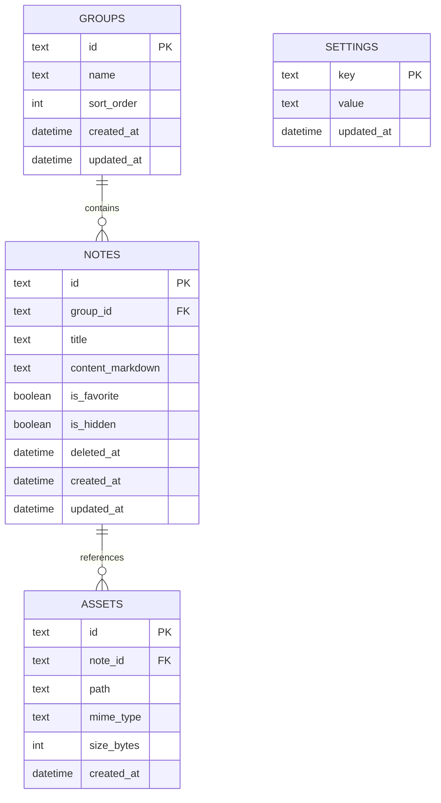

# Mote - Database Design

> Drift + SQLite. Local-first. Markdown là source of truth.

## 1. Mục tiêu

Database chỉ lưu dữ liệu cần để Mote hoạt động:

- Notes.
- Groups.
- Settings.
- Asset metadata.

Không lưu HTML render, Mermaid output hoặc rich-text document.

## 2. ERD



## 3. `groups`

| Field | Type | Rule |
| --- | --- | --- |
| `id` | TEXT | PK, UUID |
| `name` | TEXT | NOT NULL |
| `sort_order` | INTEGER | NOT NULL, default 0 |
| `created_at` | DATETIME | NOT NULL |
| `updated_at` | DATETIME | NOT NULL |

### System groups

`Inbox`, `Trash`, `Hidden` không nhất thiết phải là row thật.

Khuyến nghị:

- Inbox = `group_id IS NULL`.
- Trash = `deleted_at IS NOT NULL`.
- Hidden = `is_hidden = true`.

Như vậy tránh duplicate state và đơn giản query.

## 4. `notes`

| Field | Type | Rule |
| --- | --- | --- |
| `id` | TEXT | PK, UUID |
| `group_id` | TEXT? | FK -> groups.id, NULL = Inbox |
| `title` | TEXT | NOT NULL, default `Untitled` |
| `content_markdown` | TEXT | NOT NULL, default empty |
| `is_favorite` | BOOLEAN | NOT NULL, default false |
| `is_hidden` | BOOLEAN | NOT NULL, default false |
| `deleted_at` | DATETIME? | NULL = active |
| `created_at` | DATETIME | NOT NULL |
| `updated_at` | DATETIME | NOT NULL |

### Rule

- `deleted_at != NULL` thì note chỉ xuất hiện trong Trash.
- Trash có thể chứa hidden note, nhưng UI Trash không cần phân biệt.
- Restore đặt `deleted_at = NULL`.
- Note bị xóa vĩnh viễn sau 30 ngày.
- Xóa group không xóa note vĩnh viễn. Note trong group được chuyển về Inbox trước.

## 5. `assets`

Dùng cho image metadata.

| Field | Type | Rule |
| --- | --- | --- |
| `id` | TEXT | PK, UUID |
| `note_id` | TEXT? | FK -> notes.id |
| `path` | TEXT | NOT NULL |
| `mime_type` | TEXT? | optional |
| `size_bytes` | INTEGER? | optional |
| `created_at` | DATETIME | NOT NULL |

Binary image không lưu trong SQLite.

Native:

```text
Mote/
└── assets/images/
```

Web dùng storage phù hợp với browser và database chỉ giữ reference.

## 6. `settings`

Key-value để tránh migration chỉ vì thêm preference nhỏ.

Ví dụ:

| key | value |
| --- | --- |
| `theme` | `light` / `dark` / `system` |
| `language` | `vi` / `en` |
| `font_family` | `sans` / `serif` / `mono` |
| `editor_view` | `text` / `markdown` |
| `scrollspy_enabled` | `true` / `false` |

## 7. Indexes

MVP:

```text
idx_notes_group_id
idx_notes_updated_at
idx_notes_deleted_at
idx_notes_is_hidden
idx_notes_is_favorite
```

Search ban đầu có thể dùng title/content query đơn giản.

Nếu dữ liệu lớn và search chậm, thêm SQLite FTS sau validation. Không làm FTS ngay nếu chưa cần.

## 8. Common Queries

### Inbox

```sql
SELECT * FROM notes
WHERE group_id IS NULL
  AND deleted_at IS NULL
  AND is_hidden = 0
ORDER BY updated_at DESC;
```

### Group

```sql
SELECT * FROM notes
WHERE group_id = :groupId
  AND deleted_at IS NULL
  AND is_hidden = 0
ORDER BY updated_at DESC;
```

### Hidden

```sql
SELECT * FROM notes
WHERE is_hidden = 1
  AND deleted_at IS NULL
ORDER BY updated_at DESC;
```

### Trash

```sql
SELECT * FROM notes
WHERE deleted_at IS NOT NULL
ORDER BY deleted_at DESC;
```

### Permanent cleanup

```sql
DELETE FROM notes
WHERE deleted_at < :thirtyDaysAgo;
```

Asset file liên quan phải được cleanup cùng transaction/service flow.

## 9. Transactions

Bắt buộc transaction cho:

- Delete group -> move notes về Inbox -> delete group.
- Permanent delete note -> delete asset metadata -> delete note.
- Import library sau này.

File binary không thể rollback hoàn toàn bằng SQLite transaction, nên file service phải xử lý theo sequence an toàn.

## 10. Title Handling

MVP có thể lưu `title` riêng để list/search nhanh.

Quy tắc đề xuất:

1. Người dùng sửa title trực tiếp thì dùng title đó.
2. Nếu title rỗng, derive từ heading/text đầu tiên.
3. Nếu vẫn rỗng -> `Untitled` / `Không tiêu đề` ở UI.

Không tự sửa Markdown chỉ để đồng bộ title.

## 11. Trash 30 ngày

Không cần background service chạy liên tục.

Trigger cleanup khi:

- App start.
- Mở Trash.
- Định kỳ trong session nếu cần.

```text
now - deleted_at >= 30 days -> permanent delete
```

## 12. Migration and restore safety

Dùng Drift schema version. Current implementation schema version is `1`.

Nguyên tắc:

- Migration phải giữ nguyên Markdown content.
- Backup/export trước migration lớn nếu có thể.
- Không thay đổi schema chỉ để tối ưu sớm.
- Mỗi lần tăng `schemaVersion` phải thêm migration theo thứ tự trong `MigrationStrategy.onUpgrade`.
- Nếu thiếu migration, app dừng thay vì mở database với schema chưa được chuyển đổi.
- Full restore validates every file and relationship before modifying local data, then replaces all persisted rows in one transaction.
- Backup format version is independent from database schema version. See `Data_Portability.md`.

## 13. Không thuộc MVP

Không có các table sau:

- users
- accounts
- sync_state
- shared_notes
- permissions
- comments
- AI history

Chỉ thêm khi feature tương ứng thực sự được triển khai.

## 14. Current persisted model

The schema implemented in `AppDatabase` currently contains exactly three tables:

- `note_groups`: stable text ID, name, sort order, created and updated timestamps.
- `notes`: stable text ID, optional group ID, title, Markdown source, favorite flag, hidden flag, optional trash timestamp, created and updated timestamps.
- `settings_entries`: key, string value, and updated timestamp.

Derived collections are not separate rows:

- Inbox: `group_id IS NULL`.
- Favorites: `is_favorite = true`.
- Hidden: `is_hidden = true`.
- Trash: `deleted_at IS NOT NULL`.
- There is no separate archive state in schema version 1.

The earlier `assets` section is a future design note. No assets table or binary asset store exists in schema version 1, so it is not included in full backups.
