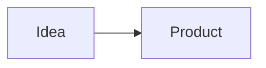

# Mote - Product Spec

> **M**arkdown N**ote**

> Một note app tối giản, local-first, tập trung vào viết Markdown nhanh và sở hữu dữ liệu của chính mình.

## 1. Mục tiêu

Mote được tạo để:

- Dùng làm note app cá nhân hằng ngày.
- Viết và quản lý blog Markdown.
- Chạy trên Web, Windows, Android và iOS.
- Là flagship case study về quá trình tạo một sản phẩm đa nền tảng bằng AI.
- Ưu tiên đơn giản, nhanh, dễ dùng hơn việc cố trở thành một bản sao của Notion.

## 2. Product Principles

1. Mở app -> viết ngay.
2. Local-first, người dùng sở hữu dữ liệu.
3. Markdown là định dạng chính.
4. Một codebase cho nhiều nền tảng nếu khả thi.
5. Giao diện tối giản, ít thao tác.
6. Không thêm tính năng chỉ vì các note app khác có.

## 3. Brand

**Tên:** Mote

**Logo:** Hạt ngô phong cách vẽ tay, đơn giản, cute.

**Phong cách UI:**
- Tối giản.
- Hiện đại.
- Light / Dark theme.
- Ít màu, nhiều khoảng trắng.
- Ưu tiên trải nghiệm đọc và viết.

## 4. Platforms

- Web
- Windows
- Android
- iOS

Ưu tiên triển khai theo thứ tự:

1. Web MVP
2. Windows
3. Android
4. iOS

## 5. Cấu trúc dữ liệu

```text
Mote
├── Inbox
├── Groups...
├── Trash
└── Hidden
```

### Group

- Tạo group.
- Đổi tên.
- Xóa.
- Chứa nhiều note.

### Inbox

Nơi mặc định cho note mới chưa được phân loại.

### Trash

- Note bị xóa được chuyển vào Trash.
- Tự động xóa vĩnh viễn sau 30 ngày.
- Có thể Restore hoặc Delete permanently.

### Hidden

- Không hiển thị trong danh sách group thông thường.
- Chỉ truy cập qua Settings.
- Dùng để ẩn các note người dùng không muốn xuất hiện thường xuyên.

## 6. Note Editor

### Format cơ bản

- H1, H2, H3, H4
- Bold
- Italic
- Underline
- Strikethrough
- Link
- Quote
- Inline code
- Code Block
- Image
- Bullet list
- Numbered list
- Checkbox
- Table đơn giản
- Mermaid diagram

### Table

Hỗ trợ Markdown table cơ bản:

```md
| Name | Status |
| --- | --- |
| Mote | Building |
```

Không cần spreadsheet features như formula, sort hoặc filter.

### Code Block

Hỗ trợ fenced code block:

````md
```python
print("Hello Mote")
```
````

Có syntax highlighting cho các ngôn ngữ phổ biến.

### Mermaid

Render Mermaid trực tiếp trong Text View:

````md

````

Markdown View vẫn hiển thị syntax gốc.

## 7. Editor Views

Có 2 chế độ:

### Text View

Hiển thị nội dung đã render để đọc và chỉnh sửa thuận tiện.

### Markdown View

Hiển thị Markdown syntax gốc.

Ví dụ:

```md
# Mote

**Simple notes.**

- Markdown
- Local-first
- Fast
```

## 8. Desktop Layout

```text
┌────────────┬──────────────────────────────┬───────────┐
│[Groups]    │                              │[Scrollspy]│
│            │         [Editor]             │           │
│[Notes]     │                              │ H1        │
│            │                              │   H2      │
│            │                              │   H2      │
│            │                              │ H1        │
└────────────┴──────────────────────────────┴───────────┘
```

### Scrollspy

Desktop có Scrollspy ở bên phải, cạnh scrollbar.

- Tự động lấy H1-H4 làm outline.
- Highlight heading của vùng đang đọc.
- Click heading để scroll tới section tương ứng.
- Có thể collapse / hide.
- Note ngắn hoặc không có heading thì tự ẩn.
- Mobile không cần Scrollspy cố định.

## 9. Fonts

Chỉ cần 3 nhóm:

- Sans
- Serif
- Mono

Người dùng chọn font cho editor trong Settings.

Không cần hệ thống font phức tạp trong MVP.

## 10. Core Features

- Auto Save
- Create / Rename / Delete note
- Create / Rename / Delete group
- Move note giữa các group
- Search toàn bộ note
- Favorite / Pin note
- Recent Notes
- Quick Note
- Copy Page Content
- Light / Dark theme
- Vietnamese / English

### Copy Page Content

Một nút copy toàn bộ nội dung hiện tại dưới dạng Markdown syntax, bất kể đang ở Text View hay Markdown View.

## 11. File & Export

Định dạng chính:

- `.md`

Export:

- `.md`
- `.txt`
- `.docx`
- `.pdf`

Không cần biến `.docx` hoặc `.pdf` thành định dạng lưu trữ nội bộ.

Markdown vẫn là source of truth.

## 12. Images

Hỗ trợ:

- Chọn image từ thiết bị.
- Drag & Drop trên Desktop/Web.
- Paste image từ clipboard.
- Render Markdown image.

```md

```

## 13. Storage

### MVP

Local-first.

- Note lưu trên thiết bị.
- Không bắt buộc đăng nhập.
- Không phụ thuộc cloud để sử dụng app.

### Sau MVP

Có thể nghiên cứu:

- Import / Export toàn bộ library.
- Google Drive.
- OneDrive.
- Git.
- Đồng bộ nhiều thiết bị.

Sync không thuộc MVP.

## 14. Blog Compatibility

Blog trên `blog.namnth.com` sử dụng cùng Markdown convention với Mote.

Mục tiêu:

```text
Viết trong Mote
      ↓
Copy / Export Markdown
      ↓
Đưa vào blog
      ↓
Render gần như giống trong Mote
```

Các thành phần cần tương thích:

- Heading
- Text formatting
- Lists
- Quote
- Code
- Code Block
- Image
- Table
- Mermaid

## 15. MVP Scope

### Phải có

- Note + Group
- Inbox
- Trash 30 ngày
- Hidden
- Pin / Favorite
- Markdown Editor
- Text / Markdown View
- Basic formatting
- Table
- Code Block
- Mermaid
- Search
- Auto Save
- Copy Markdown
- Light / Dark
- Scrollspy Desktop
- Save as .txt
- `.md` export
- PDF / DOCX export

### Làm sau

- Advanced syntax highlighting
- Quick Note shortcut
- Import library
- Cloud backup
- Sync
- Public sharing

## 16. Implementation Roadmap

### Phase 1 - Web MVP

1. App shell + responsive layout.
2. Local storage architecture.
3. Group + Note CRUD.
4. Markdown editor.
5. Text / Markdown View.
6. Formatting + Table + Code Block + Mermaid.
7. Search.
8. Trash + Hidden.
9. Scrollspy.
10. Theme + language.
11. Copy / Export Markdown.
12. Manual QA.
13. Deploy Web.

**Output:** Mote Web MVP.

### Phase 2 - Desktop

1. Reuse core code.
2. Adapt filesystem/storage.
3. Add desktop shortcuts.
4. Drag & Drop / clipboard improvements.
5. Package Windows app.
6. Test installer and local files.

**Output:** Mote for Windows.

### Phase 3 - Mobile

1. Adapt responsive editor.
2. Mobile navigation.
3. Touch-friendly toolbar.
4. Local storage.
5. Android build + test.
6. iOS build + test.

**Output:** Mote for Android + iOS.

### Phase 4 - Validation

Theo dõi:

- Số người dùng thử.
- Người quay lại.
- Feature request lặp lại.
- Bug phổ biến.
- Feedback về editor.
- Nhu cầu sync / backup.

Chỉ dựa trên dữ liệu này để quyết định V2.

## 17. Definition of Done - Web MVP

Mote Web MVP hoàn thành khi người dùng có thể:

1. Mở app và tạo note ngay.
2. Tổ chức note bằng group.
3. Viết các Markdown format đã định nghĩa.
4. Render Table, Code Block và Mermaid.
5. Chuyển giữa Text / Markdown View.
6. Điều hướng note dài bằng Scrollspy trên Desktop.
7. Search note.
8. Xóa / khôi phục note.
9. Ẩn note.
10. Copy hoặc export Markdown.
11. Đóng và mở lại app mà dữ liệu vẫn còn.
12. Sử dụng tốt trên Desktop và Mobile Web.

> Làm xong Web MVP trước. Không để Windows, Android, iOS hoặc Sync làm chậm việc launch phiên bản đầu tiên.
